# Wanderlust: DevSecOps CI/CD with Jenkins and GitOps

A three-tier MERN blogging application (React and Vite frontend, Node.js/Express API, MongoDB and a Redis cache) with a Jenkins CI pipeline that scans and containerises it, and a GitOps CD job that promotes each new image to Kubernetes by committing to Git.


<p>
  
  
  
  
</p>

## What this demonstrates

- A pipeline where security gates can fail the build: Trivy, OWASP Dependency-Check and a SonarQube quality gate
- Separating CI from CD, with delivery driven by a commit to Kubernetes manifests rather than a direct push to the cluster
- Running a three-tier application with MongoDB and Redis under both Docker Compose and Kubernetes

## Pipeline

```mermaid
flowchart LR
    subgraph CI["CI job: Jenkinsfile"]
        A["Validate image tags"] --> B["Git checkout"]
        B --> C["Trivy filesystem scan"]
        C --> D["OWASP Dependency-Check"]
        D --> E["SonarQube analysis<br/>+ quality gate"]
        E --> F["Write EC2 public IP<br/>into .env files"]
        F --> G["Docker build<br/>backend + frontend"]
        G --> H["Push to Docker Hub"]
    end
    subgraph CD["CD job: GitOps/Jenkinsfile"]
        I["Update image tags in<br/>kubernetes/*.yaml"] --> J["Commit + push to GitHub"]
    end
    H -->|"triggers Wanderlust-CD"| I
    J --> K["GitOps controller<br/>syncs the cluster"]
```



### CI (`Jenkinsfile`)

- Requires the parameters `FRONTEND_DOCKER_TAG` and `BACKEND_DOCKER_TAG`, and stops immediately if either is empty.
- Its stages call a Jenkins shared library named `Shared`: `code_checkout`, `trivy_scan`, `owasp_dependency`, `sonarqube_analysis`, `sonarqube_code_quality`, `docker_build` and `docker_push`.
- The environment stage runs `Automations/updatebackendnew.sh` and `updatefrontendnew.sh` in parallel. They look up the EC2 instance's current public IP with the AWS CLI and write it into `FRONTEND_URL` (backend) and `VITE_API_PATH` (frontend).
- On success it archives the XML scan reports and triggers the `Wanderlust-CD` job with the same tags.

### CD (`GitOps/Jenkinsfile`)

- Rewrites the image tags in `kubernetes/backend.yaml` and `kubernetes/frontend.yaml`, commits, and pushes to GitHub with the `Github-cred` credentials.
- Emails the build log on success and on failure.

## Run locally with Docker Compose

Create `frontend/.env.docker` containing `VITE_API_PATH="http://localhost:31100"`, then:

```bash
docker compose up --build
```

| Service | Address |
|---|---|
| Frontend | http://localhost:5173 |
| Backend API | http://localhost:31100 |
| MongoDB | `localhost:27017` |
| Redis | Internal to the Compose network |

The backend reads its settings from `backend/.env.docker`.

## Kubernetes

`kubernetes/` holds manifests for the frontend, backend, MongoDB and Redis, plus a PersistentVolume and PersistentVolumeClaim. `kubernetes/README.md` and `kubernetes/kubeadm.md` walk through deploying to a two-node kubeadm cluster on EC2.

## Infrastructure

`terraform/` provisions the EC2 host: a `t2.large` instance with a 30 GB root volume in `us-east-2`, a key pair, and a security group that allows SSH, HTTP and HTTPS.

## Running it yourself

The pipeline files still carry values from the upstream project. Replace these before running them:

| Where | Value to replace |
|---|---|
| Both Jenkinsfiles | Checkout URL `LondheShubham153/Wanderlust-Mega-Project`: use your fork |
| `Jenkinsfile` | Docker Hub namespace `trainwithshubham`: use yours |
| `GitOps/Jenkinsfile` | Notification address in the `post` block |
| `Automations/*.sh` | `INSTANCE_ID`: your EC2 instance |

Jenkins also needs the `Shared` library configured globally, a SonarQube Scanner tool named `Sonar`, and credentials for GitHub (`Github-cred`) and Docker Hub.

## Credits

- **Application:** [Wanderlust](https://github.com/krishnaacharyaa/wanderlust) by Krishna R Acharya, under the MIT licence (see `LICENSE`)
- **DevOps pipeline:** [Wanderlust Mega Project](https://github.com/LondheShubham153/Wanderlust-Mega-Project) by TrainWithShubham

---

<div align="center">
  <sub>Maintained by <a href="https://github.com/RajGenStack">Rajan Kumar</a> · <a href="https://www.linkedin.com/in/rajan-kumar42">LinkedIn</a></sub>
</div>
